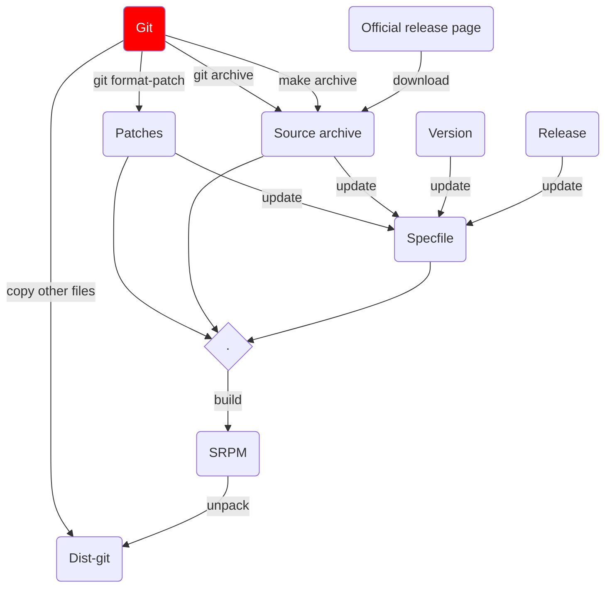

# Customizing 'source-git update-dist-git'

Starting question: How do we transform an upstream repository to dist-git?
What are the steps that are required, and what actions or transformations
happen along the way?



In the flowchart above the transformation process includes building and then
unpacking an SRPM. This step serves as a (partial) validation of the integrity
of the content to be committed to dist-git, and it is inspired from the
[Kernel source-git workflow].

In order to build an SRPM 3 things need to be configurable:

1. How the source archive is created.
2. How patches are produced from the Git-history.
3. The way the spec-file is generated or updated.

Packit already has actions for all three of these, and all these actions run
as part of `packit srpm`. To make the three aspects above configurable,
`source-git update-dist-git` could be updated to run `packit srpm` under the
hood, and use the unpacked SRPM to update dist-git.

The functionality provided by `files_to_sync` wouldn't be changed:
additionally to unpacking the SRPM to dist-git, `update-dist-git` should also
consider syncing the content specified by `files_to_sync`.

Besides this the following improvements could be made:

## Improvements to 'create-archive'

Currently `create-archive` takes a command or a list of commands which are
executed in a non-shell environment. There is also the top-level `sources`
key, which has a similar role to `create-archive`, but instead of running some
commands, it will download and save the archive.

These two could be merged, by allowing `create-archive` to also be a
dictionary, and introducing two new configuration sub-keys: `download` and
`script`.

`create-archive.script` would take a single or multi-line string and run it as
a bash script. This behavior is similar how multi-line scripts are handled in
GitHub or GitLab workflows.

`create-archive.download` would be synonymous to `sources`.

Examples:

```yaml
actions:
  create-archive:
    download:
      - url: https://my_website.com/
        path: name
```

```yaml
actions:
  create-archive:
    script: |
      rm *.tar.gz
      make archive
```

## Improvements to 'create-patches'

`create-patches` currently expects a command or a list of commands. The
`script` subkey could be introduced here, too, in order to make the
configuration syntax similar to `create-archive`. Other subkeys could be
introduced later on, to provide some pre-defined (but still configurable) ways
to generate patches.

Currently there is no mechanism to pass the patches produced by this action to
`fix-spec-file`.

## Improvements to 'fix-spec-file'

`fix-spec-file` currently expects a command or a list of commands. Similarly
to the previous two changes, `script` could be introduced, to be consistent
with the other three.

## Stories proposed

- Introduce a `script` key for all actions. This key would be a single or
  multi-line string which is going to be executed as a bash script.
  (packit/packit#1641)
- Introduce `create-archive.download` to be a synonym for `sources`. Mark
  `sources` as deprecated. (packit/packit#1642)
- Update `source-git update-dist-git` to use `packit srpm` under the hood,
  unpacking the SRPM to dist-git. (packit/packit#1643)
- Provide patches produced by `create-patches` for `fix-spec-file`.
  (packit/packit#1644)

[kernel source-git workflow]: https://gitlab.com/redhat/centos-stream/src/kernel/centos-stream-9/-/blob/main/redhat/scripts/rh-dist-git.sh#L60
