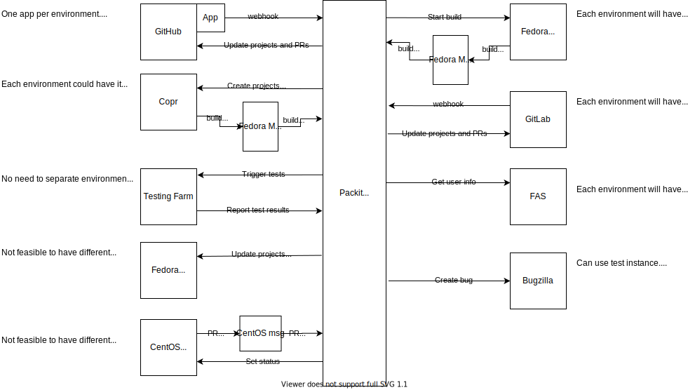

# Deploy a testing instance for Packit-as-a-Service

AC:

- figure out how we want to do this epic
- write down your findings in a document
- discuss with the team and get a consensus

## How should the deployment be triggered?

At least in the beginning we might not want to deploy every single PR, so we
might need to have an explicit way for triggering this.

**Minimal solution:** write a script taking some arguments, which each of us
can run locally. For this each of us would need to have the credentials to the
environment(s) the script needs to interact with.

**One step further:** have some service/bot, listening to GitHub
comments/label changes and running the deployment script. We could check with
softwarefactory folks if we could get a new Zuul pipeline to handle this. Or
use GitHub Actions... Secrets to access and manage the test environment will
need to be shared with this service.

## What if multiple repositories are involved?

The script/bot should understand references to PRs of the repositories. (Later
on we can extend this to be able to reference branches or commits or even
different repositories, but for the beginning we can stick to PRs.)

By default all components should use stg images, but it should be possible to
modify this default to 'prod'.

Repositories:

- packit/packit-service
- packit/packit
- packit/ogr
- packit/dashboard
- packit/tokman
- packit/sandcastle
- packit/deployment
- packit/packit-service-centosmsg
- packit/packit-service-fedmsg

Examples:

```
$ deploy --base=prod packit-service=614
$ deploy packit-service=800 ogr=123
$ deploy packit=456 deployment=321
```

## What are the steps required to deploy the new content?

1. Build images from the PRs.
2. Check if the test environment is free.
3. Make sure the test environment is cleaned up after previous deployments.
4. Run deployment with the new images.

## Where to build the images?

- Docker Hub
  - Slow; there can be only one build in our project, since we are using a
    free account.
  - It's not that obvious how to trigger on-demand builds from PRs.
    - Actually, @sakalosj told that it's possible to trigger builds using the
      Docker Hub API, but the method is not documented.
- Quay
  - [Similar](http://docs.quay.io/guides/custom-trigger.html) to Docker Hub.
- OpenShift Online
  - Costs us money.
  - But we could use resource limits to have it under control.
- PSI
  - Behind the firewall.
  - But builds could push images to a public registry.

## Which namespace/cluster should we use for the deployment?

The original idea was to use stg, but maybe it would be better to have a dev
environment, so that we can keep stg for pre-prod integration.

API endpoints of the test deployment should be publicly available, in order to
allow the connected services to reach it. Because of this, these deployments
will need to be done in OpenShift Online (at least at the beginning).

## Environment isolation tactics

Packit-as-a-Service interacts with many other services, so we need to make
sure that different deployments of Packit-as-a-Service don't conflict with
each other, when it comes to interacting with these services.

Here are the ways we could achieve this:

- Each deployment has it's own GitHub App.
- Each deployment has it's own FAS user account.
  - And so it's own Copr account.
  - We'll need to manually create these FAS users.
- Each deployment is using it's own Copr organisation.
- Each deployment is using it's own GitLab.com account.
- Dist-git is more problematic, as we don't want to create noise in prod
  dist-git with all the testing activities, but there is currently no stg
  instance we could use either.
  - To test interacting with dist-git PRs we can use repositories owned by us.
- The service only reacts to Copr events for builds which were started by it.



## What about partial deployments?

In some cases it might make sense not to deploy the whole thing, but only a
part of it. We could use the `with_*` flags for this, but not sure if enabling
this is a priority.

## How to indicate that the environment is being used?

As for the beginning we will have a single environment we'll need some way to
indicate that it's "taken".

We could have some OpenShift object set in the project when there is a
deployment running in it.

We could set a time-limit on test deployments, so that we don't accidentally
leave the environment blocked.
