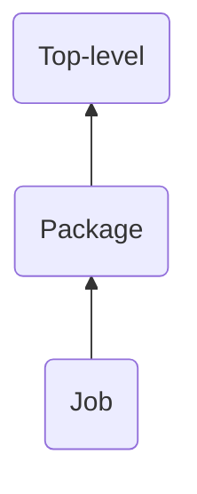

# Support for Monorepos

Monorepos store the source code of multiple projects in a single repository.
They are a special use-case from a source-git point of view, because an
upstream monorepo maps to multiple dist-git repositories in the distribution.

One example for the above is [LLVM] from which code flows into multiple
dist-git repositories in Fedora Linux.

Currently Packit maps an upstream repo to a single dist-git repo in the
distribution.

To change this, a mechanism to specify which path(s) in the monorepo to map to
which dist-git repo in the distribution needs to be introduced.

This could be done by introducing a `packages` key, to hold a dictionary of
`{package_name: package_object}`. Package-objects would have keys identical
to the current top-level keys in `.packit.yaml` and `source-git.yaml`.

A package-object could also have a new `paths` key which is a list of
paths in the monorepo which map to the dist-git repo specified by
`downstream_package_name`.

If `downstream_package_name` is not specified, it would be assumed that the
dist-git repo is called `package_name`.

If `package.paths` is not defined, it defaults to the root of the monorepo,
that is to `paths: ["./"]`. This probably implies that paths need to be
explicitly defined for each package.

When processing a package from a monorepo, Packit should operate within these
paths, that is, limit patch generation from Git-history to these paths, and
use only these paths to create the source-tarballs.

<!-- markdown-toc start - Don't edit this section. Run M-x markdown-toc-refresh-toc -->

**Table of Contents**

- [`package.paths` and subdirectories to react on](#packagepaths-and-subdirectories-to-react-on)
- [`package.paths` and working directories](#packagepaths-and-working-directories)
- [Packages and specfile discovery](#packages-and-specfile-discovery)
- [Impact on Source-git](#impact-on-source-git)
  - [`packit source-git init`](#packit-source-git-init)
  - [`packit source-git update-dist-git`](#packit-source-git-update-dist-git)
  - [`packit source-git update-source-git`](#packit-source-git-update-source-git)
  - [`packit source-git status`](#packit-source-git-status)
  - [Hardly](#hardly)
- [Impact on Packit](#impact-on-packit)
  - [packit init](#packit-init)
  - [packit srpm](#packit-srpm)
  - [packit copr-build](#packit-copr-build)
  - [packit local-build](#packit-local-build)
  - [packit build](#packit-build)
  - [packit propose-downstream](#packit-propose-downstream)
  - [packit sync-from-downstream](#packit-sync-from-downstream)
  - [packit create-update](#packit-create-update)
  - [packit push-updates](#packit-push-updates)
  - [packit status](#packit-status)
  - [packit validate-config](#packit-validate-config)
  - [packit prepare-sources](#packit-prepare-sources)
- [Impact on Packit API](#impact-on-packit-api)
  - [Internal Design](#internal-design)
  - [Inheritance (Overriding) of Configuration Keys](#inheritance-overriding-of-configuration-keys)
  - [Impact on Actions](#impact-on-actions)
- [Backwards Compatibility](#backwards-compatibility)
- [Open Issues](#open-issues)

<!-- markdown-toc end -->

## `package.paths` and subdirectories to react on

In the context of monorepos it becomes handy to be able to filter the events a
service or bot reacts to based in which paths of the monorepo the change
happened.

This is different from `package.paths` in the sense that it allows bots and
services to react to a broader (or different) list of paths than the ones
defined to belong to a package.

To support this a new `handle` configuration key should be introduced with a
`paths` sub-key.

`handle.paths` can be defined on the top-level, in the package-level (although
it's not going to be used by the CLI) and on the job-level, and it's inherited
as other configuration keys.

`handle.paths` extends the trigger config option of jobs, by limiting the
validity of the trigger to the paths defined.

When the `packages` key is used, jobs have their `handle.paths` set to the
list of `package.paths` of the packages to be handled by the job. If
`packages` is not used, the default value is the path of the root of the Git
repo.

We could mimic the GitHub syntax here, and also provide `handle.ignore_paths`
and the exclamation-mark syntax (`handle.paths: [!exluded/path, included/path]`).

Providing `handle.ignore_paths` would be interesting, b/c it could be used to
ignore certain paths for all the packages, by defining its values on the
top-level.

Note, that a top-level `handle.paths` would be always overrode by a
`package.paths`. A `!flatten` tag would come handy here, too, to allow to use
references to combine lists in YAML.

Introducing `handle.paths` would be independent of introducing `packages`
(monorepo support), as it can be useful even without that, in fact [it was
requested] some long time ago.

For an example see the [Impact on Packit](#impact-on-packit) chapter below.

## `package.paths` and working directories

It's still not clear if having a `working_dir` configuration value to set a
custom working directory would be strictly required for monorepo support.
User-defined actions can always `cd` to the sub-directory of their liking. As
for default actions, it's less complicated if they all run from the root of
the Git repository.

## Packages and specfile discovery

Without `packages`:

1. `specfile_path`, if defined.
2. `<downstream_package_name>.spec`, if `downstream_package_name` set.
3. Recursively search the Git repository.

With `packages`, for each package:

1. `specfile_path`, if defined.
2. `<downstream_package_name>.spec` in all the `paths`, either because
   `downstream_package_name` is defined for the package, or because it
   defaults to the name of the package.
3. Recursively search all the `paths` of the package.

Both in the case of 2. and 3. `paths` are searched in the order in which they
are defined in the configuration file.

## Impact on Source-git

Example:

```yaml
upstream_project_url: https://github.com/llvm/llvm-project.git
upstream_ref: llvmorg-13.0.0-rc3
packages:
  lit:
    downstream_package_name: python-lit
    specfile_path: .distro/python-lit/python-lit.spec
    paths:
      - llvm/utils/lit
    # This could be also used, but it's not required here.
    # patch_generation_ignore_paths:
    # - .distro
    sync_changelog: true
    files_to_sync:
      - src: .distro/python-lit/
        dest: .
        delete: true
        filters:
          - protect .git*
          - protect sources
          - exclude .gitignore
    sources:
      - path: lit-13.0.0rc1
        url: https://src.fedoraproject.org/repo/pkgs/rpms/python-lit/lit-13.0.0rc1/sha512/000a6875d371793ccab7f9c7af0e5906d1d98bb8ff09b297b7f0978c083ec05acb48fd8dbd1647bc9ba6548c8c629cc693219ce8d247877eab14ff250e46cfed/lit-13.0.0rc1
```

With the above source-git configuration could be kept in
`.distro/source-git.yaml`. Downstream files to be synced to dist-git are to be
kept in subdirectories, named according to `package_name` (the key used in
`source-git.yaml` to reference the package), in `.distro`, to keep things
organized.

An example layout:

```
.distro
├── backend
│   └── copr-backend.spec
├── cli
│   └── copr-cli.spec
├── frontend
│   └── copr-frontend.spec
└── source-git.yaml
```

This way all distribution configs and files would be kept at one place, which
probably is somewhat better than having source-git configuration spread across
the monorepo, in different subdirectories. This setup also allows multiple
paths from the repo mapped to a signle dist-git repo.

### `packit source-git init`

If the source-git repository to be initialized is a monorepo, then each
dist-git repository specified will also need to one or more subdirectories of
the source-git repository.

Which makes the whole thing a little bit too complicated ☺

This complication could be elevated, if `packit source-git init` would use a
guided (dialog-like) process, instead of taking all its inputs as arguments.

As an alternative, the command could have a variant where it takes a basic
`packages` definition to guide the initialization of a source-git monorepo.

Example `packages.yaml`:

```yaml
- downstream_package_name: copr-backend
  path: backend
  dist_git_path: rpms/copr-backend
  dist_git_branch: rawhide
- downstream_package_name: copr-frontend
  path: frontend
  dist_git_path: rpms/copr-frontend
  dist_git_branch: rawhide
- downstream_package_name: copr-cli
  path: cli
  dist_git_path: rpms/copr-cli
  dist_git_branch: rawhide
```

Which could be used as:

```shell
$ packit source-git init --packages packages.yaml v3.0.0 src/copr
```

Or the same could be read from STDIN, with `--packages=-`:

```shell
$ packit source-git init --packages=- v3.0.0 src/copr
```

Given that setting up a source-git repository is expected to be a one-time
activity, and that there are not so many projects which are monorepos,
implementing the above should probably have **a low priority for now**.

### `packit source-git update-dist-git`

**At a minimum**, the command should be updated to support monorepos, and
transform only the content specific to the package from source-git. The
package name (`downstream_package_name`) to be considered from
`.distro/source-git.yaml` is the one which matches `basename DIST_GIT`.

**Going further**, when used with monorepos, this command could be able to
update multiple dist-git repositories. This means, that the `DIST_GIT`
argument of the command would become `DIST_GIT [DIST_GIT...]` (one or more
paths to dist-git repositories).

In the form above, the command would update only the dist-git repositories
which are specified on the command line. If any of the `DIST_GIT` arguments
specified is not a `downstream_package_name` in `.distro/source-git.yaml`, the
command would fail. This would be an early check, before any other change is
done.

An alternative form of the command could allow updating multiple dist-git
repositories found in `--dist-git-store`. The command would figure out
dist-git subdirectory names in `--dist-git-store`, based on
`downstream_package_name`s found in `.distro/source-git.yaml`. If any of them
is missing, the command would fail early.

```
SYNOPSIS
       packit source-git update-dist-git [OPTIONS] --dist-git-store PATH SOURCE_GIT
```

Example:

```shell
$ packit source-git update-dist-git --dist-git-store rpms/ src/copr
```

### `packit source-git update-source-git`

Let's not change the interface of this command and don't support the usecase
to update a single source-git monorepo from multiple dist-git repositories in
order to avoid complications. Expect that multiple commands are going to be
executed if updates need to be taken from multiple dist-git repositories.

On the other hand, the command needs to be updated to support a source-git
repo as a target when the source-git repo is a monorepo. In this case only the
paths of the sub-package need to be considered during the update. `DIST_GIT`
should match one of the `downstream_package_name`s in `.distro/source-git.yaml`.

### `packit source-git status`

The command should check the sync status of a sub-package from a source-git
monorepo and the corresponding dist-git repo. `downstream_package_name` should
match `basename DIST_GIT`.

### Hardly

When opening an MR in a source-git monorepo, Hardly should figure out which
dist-git packages are going to be impacted by the change (by looking at
`package.paths`), and open mirror-MRs in the dist-git repositories of those
packages.

CI results from all mirror-MRs should be synced back to the source-git MR.

**Open question**: Is the behavior above good enough? Can there be source-git
changes happening outside the package paths, but which influence the dist-git
content of the package?

## Impact on Packit

All things that follow assume that [the `metadata` key was dropped].

Additionally to what was presented above, a new property of job-objects in
`.packit.yaml` needs to be introduced, to be used to specify which packages
the job should handle when triggered. The property would be called `packages`
and would be a list of package-object names. If a job-object has no such key,
all packages of a monorepo should be handled.

Example:

```yaml
handle:
  ignore_paths:
    - doc
upstream_project_url: https://pagure.io/copr/copr.git
packages:
  copr-backend:
    # defining 'specfile_path' would be optional
    specfile_path: backend/copr-backend.spec
    paths:
      - backend
  copr-frontend:
    specfile_path: frontend/copr-frontend.spec
    paths:
      - frontend
  copr-cli:
    specfile_path: cli/copr-cli.spec
    paths:
      - cli
jobs:
  - job: copr_build
    trigger: pull_request
    targets:
      - fedora-all
      - epel-8
    packages:
      - copr-frontend
      - copr-backend
    handle:
      paths:
        - backend
        - frontend
        - common
  - job: copr_build
    trigger: pull_request
    targets:
      - fedora-all
    packages:
      - copr-cli
    handle:
      paths:
        - cli
        - common
```

### packit init

No changes are required for this command. `.packit.yaml` is expected to be
crafted manually if the upstream repository is a monorepo.

### packit srpm

The command should receive a new optional argument, `[PACKAGE...]`, to define
zero or more packages for which an SRPM should be built.

If no such argument is present, an SRPM should be produced for all packages
defined in `.packit.yaml`. When one or more such arguments are present, and
SRPM should be produced only for the packages specified.

The command should fail if any of the `PACKAGE` argument has no corresponding
`downstream_package_name` in `.packit.yaml`.

When a `PACKAGE` argument is used `PATH_OR_URL` is expected to be explicitly
provided. Example:

```shell
$ pwd
/home/user/src/copr
$ packit srpm . backend
```

### packit copr-build

Similar to `packit srpm`, the command should receive a new optional
`[PACKAGE...]` argument, which should allow to trigger Copr-builds only to
those the packages specified.

### packit local-build

Similar to `packit srpm`.

### packit build

Similar to `packit srpm`.

### packit propose-downstream

Similar to `packit srpm`. When a `PACKAGE` argument is specified updates are
proposed only for those packages, and specifying `PATH_OR_URL` and `VERSION`
becomes mandatory.

### packit sync-from-downstream

This is copying synced files from downstream to upstream.

The command needs to support the same `[PACKAGE...]` argument as
`packit srpm`, and sync from only the specified dist-git repositories, when at
least on of such an arguments is specified.

### packit create-update

Similar to `packit srpm`. When a `PACKAGE` argument is specified updates are
created only for the specified packages.

There should be **one update created**, including all (or the specified
subset) of packages (packages from a monorepo are usually [released as a batch]).

### packit push-updates

This command works with updates. Currently if no option is provided updates
which are in testing and belong to the package are pushed.

In a monorepo, if no argument is provided, all updates in testing which
contain any of the packages in the monorepo should be pushed.

If one or more `PACKAGES` are specified, all updates in testing which could be
pushed and contain any of the packages specified should be pushed.

### packit status

The command should display status for all packages in a monorepo, or if one
more `PACKAGES` are specified, status should be displayed for those packages.

### packit validate-config

Check if the paths specified in `package.paths` do exist in the monorepo.

Check if the package names (`downstream_package_name`) are correct and indeed
exist in the distribution. See [packit/packit#88].

### packit prepare-sources

The command should be updated similar to `packit srpm`, so that it's possible
to limit changes only to select packages.

## Impact on Packit API

### Internal Design

With monorepos needs to be taught to map a single upstream repository
(`PackitAPI.up`) to multiple dist-git/downstream repositories. This means that
`PackitAPI.dg` should become a dictionary holding the objects for each
dist-git repository.

In order to make the transition easier, we could keep `.dg` as it is, and make
it to return the dist-git repo for the first (and only) package. If there are
more packages defined, an exception should be raised. This way parts of the
API and CLI which were not yet updated to support monorepos, could continue to
work, but would fail if used with a monorepo configuration specifying multiple
packages.

### Inheritance (Overriding) of Configuration Keys

One can override configuration defined on the top-level of `.packit.yaml` in a
package-object. That is, all top-level values are inherited by package-objects.

Configuration values can be further overridden in job objects, but only for
the packages the job references (if any.)



A (not very meaningful) example:

```yaml
srpm_build_deps:
  - python3-pip
  - python3-setuptools
packages:
  subpackage1:
    paths:
      - package1
    srpm_build_deps:
      - python3-pip
      - python3-setuptools
      - python3-packaging
  subpackage2:
    paths:
      - package2
jobs:
  - job: copr_build
    trigger: pull_request
    srpm_build_deps:
      - python3-pip
      - python3-setuptools
      - cowsay
    targets:
      - fedora-all
  - job: copr_build
    trigger: release
    packages:
      - subpackage1
    targets:
      - fedora-all
      - epel-9
```

In the example above when building PRs in Copr, the `srpm_build_deps` defined
in the job would be used for both packages.

On the other hand, when building releases in Copr, only `subpackage1` is going
to be built, and the `srpm_build_deps` will be the ones defined for the
package in the `packages` section.

The example above could be made more useful if extending lists would be
supported by Packit. (YAML doesn't support this, one gets nested lists when
using references in lists.)

### Impact on Actions

Because actions can now be defined on the top-level, package-level and
job-level, one might ask, in what path these should be executed.

Because a package can map to multiple sub-paths in the monorepo, the most
sensible thing to do is to keep it simple and execute each action at the
top-level, even if the action is defined on a job- or package-level. If
needed, user-defined actions can still `cd` into a preferred sub-directory.

## Backwards Compatibility

For backwards compatibility: if the top-level `packages` key is missing,
source-git configuration is read as currently is.

## Open Issues

- TODO Can archives stored in the dist-git repositories mapped to one or more
  paths in the upstream repo?
- TODO Is support needed to have different packages generated from different
  git refs? (This would defy the point in having a monorepo, but some might
  require it, for example [Copr].)

[llvm]: https://github.com/llvm/llvm-project
[copr]: https://pagure.io/copr/copr
[released as a batch]: https://bodhi.fedoraproject.org/updates/FEDORA-2022-8f02fc9461
[packit/packit#88]: https://github.com/packit/packit/issues/88
[the `metadata` key was dropped]: https://github.com/packit/packit/issues/1515
[it was requested]: https://github.com/packit/packit-service/issues/545
