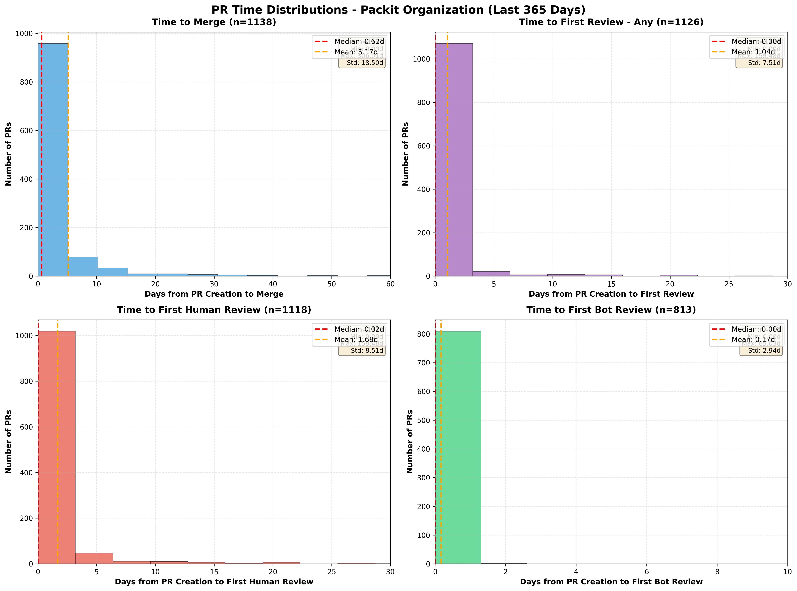
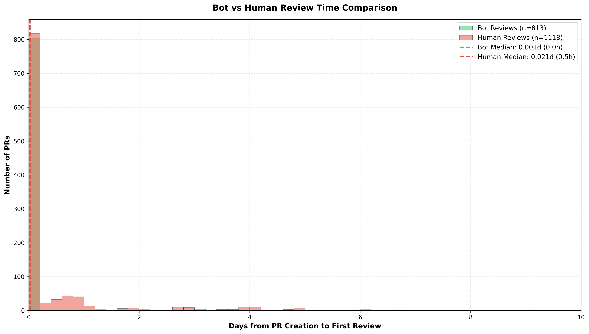
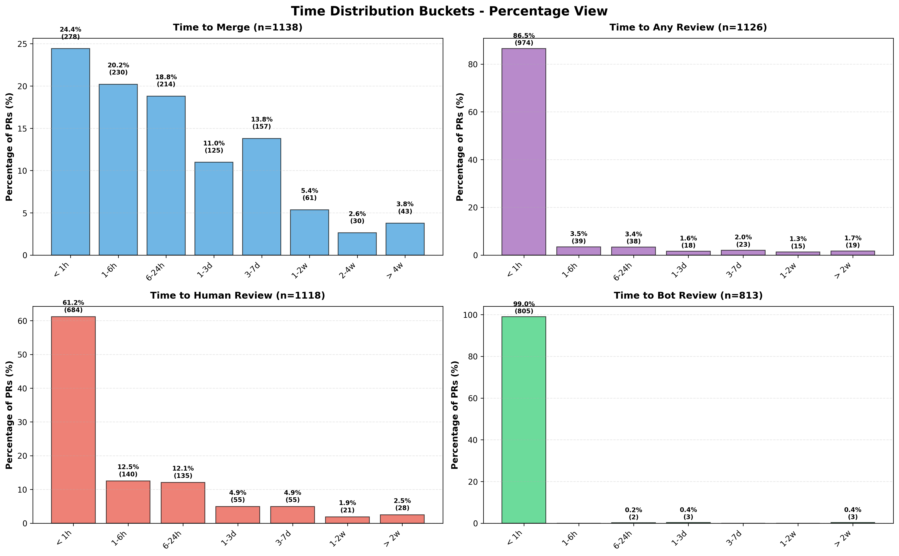
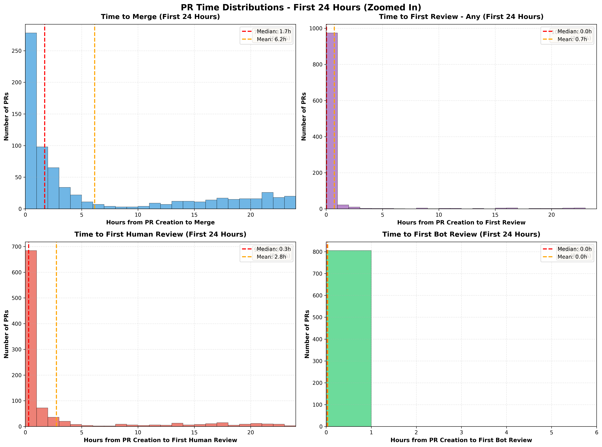

This analysis looks at pull requests in the Packit organization over a rolling 365-day period. It focuses on three timestamps:

- when a pull request was opened;
- when the first review was submitted, separating human and bot reviewers; and
- when the pull request was merged.

The source data contains 1,138 merged pull requests. Of these, 1,126 had a recorded review, 1,118 had a human review, and 813 had a bot review. The scripts used to calculate the timings are included alongside this post.

## The headline result

Most review activity happens quickly, but the averages are pulled upward by a small number of very old pull requests. The median time to the first human review is about 30 minutes, while the median time to merge is about 15 hours. The corresponding means are much larger: 1.68 days for a human review and 5.17 days to merge.

That difference is not a contradiction. It says that a typical pull request moves quickly, while a minority remains open for days or weeks. For this workflow, medians and distributions are more useful operational measures than means alone.

## First review: automation is almost immediate

The first-review distribution is concentrated at the left edge of the chart:

- 974 of 1,126 pull requests, or 86.5%, received some kind of review within one hour.
- 39 (3.5%) received their first review in one to six hours.
- 38 (3.4%) took six to 24 hours.
- Only 75 pull requests, 6.7%, took more than a day to receive a first review.

The overall median is effectively zero days and the mean is 1.04 days. This is another example of a long tail: the majority are reviewed immediately, but a few late reviews dominate the average.

The bot and human measurements explain why the first-review number is so low. Bot reviews have a median of roughly zero hours and a mean of 0.17 days, or about four hours. Human reviews have a median of about 0.5 hours and a mean of 1.68 days.

The bucket view makes the difference especially clear:

- 805 of 813 pull requests with a bot review, 99.0%, received it within one hour.
- 684 of 1,118 pull requests with a human review, 61.2%, received it within one hour.
- A further 275 human reviews, 24.6%, arrived between one and 24 hours.
- Human reviews still had a visible tail: 104, or 9.3%, arrived after three days.

The automation is therefore doing something valuable even when it does not replace a human reviewer: it provides immediate feedback while the pull request is waiting for a person.

## Merge time is a different metric

Review arrival and merge completion should not be treated as the same outcome. A review can be available immediately while a pull request waits for changes, discussion, a maintainer decision, CI, or an appropriate merge window.

The merge-time distribution has a median of 0.62 days, approximately 15 hours, and a mean of 5.17 days. Its buckets are:

- 278 pull requests (24.4%) merged in less than one hour.
- 230 (20.2%) merged in one to six hours.
- 214 (18.8%) merged in six to 24 hours.
- 282 (24.8%) merged between one and seven days.
- 134 (11.8%) took more than one week.
- 43 (3.8%) took more than four weeks.

In other words, 63.4% merged within a day, but more than one in ten remained open for over a week. The long tail is large enough to matter to planning even though it does not describe the typical pull request.

The zoomed view also shows that fast merges are not all clustered at one instant. There is a substantial set of merges in the first hour, followed by a gradual decline throughout the day. This suggests that both immediate automation and human availability contribute to the observed throughput.

## What this suggests for our process

### Keep automation early and non-blocking where appropriate

Bot feedback arrives faster and more consistently than human feedback. That makes it well suited to cheap checks, dependency updates, formatting, and other feedback that benefits from being available before a human starts reviewing. The data does not show that bot feedback is sufficient for every change, but it does show that it can shorten the time to useful first feedback.

### Optimize the tail, not just the median

The median experience is already fairly fast. The larger opportunity is the tail: pull requests that receive no timely human attention or that remain open for more than a week. A useful next step would be to identify the causes of those cases, such as ownership gaps, review requests without a response, failing checks, author inactivity, or changes that require cross-team coordination.

### Track review latency separately from delivery latency

"Time to first review" measures responsiveness. "Time to merge" measures the whole path to integration. Combining them into one metric would hide where delay occurs. Both should be reported, preferably with medians and percentile or bucket distributions rather than only means.

## Method and limitations

The analysis scripts read one JSON file per pull request, calculate elapsed time from `createdAt` to review and merge timestamps, classify reviewers as bots or humans, and generate the figures in this directory. The bot classification uses a known-account list plus login-name heuristics such as `-bot`, `[bot]`, or the substring `bot`.

There are several important limitations:

- The sample is limited to merged pull requests, so abandoned or still-open work is not represented.
- The figures report available observations for each metric, not necessarily the same set of pull requests. For example, the plotted samples are 1,138 for merge time, 1,126 for any review, 1,118 for human review, and 813 for bot review.
- The scripts use the first review in the API response for the basic analysis. This assumes the review list is ordered chronologically; the bot-aware analysis explicitly scans timestamps when separating humans and bots.
- A review submission is only a proxy for useful feedback. It does not measure review depth, requested changes, discussion quality, or whether the author acted on the review.
- The percentile implementation uses indexed observations rather than an interpolated percentile definition, so percentile values should be treated as approximate.
- The one-year snapshot describes this period and organization. It is not a universal benchmark for other projects.

These caveats do not change the main conclusion: Packit's review process is fast for the typical pull request, automation provides feedback exceptionally quickly, and the main source of delay is the smaller population in the long tail. Future analyses should connect timing with pull-request size, repository, author and reviewer workload, CI status, and outcome so that improvements target causes rather than just symptoms.
